# Sync Guide

Keep your prompts in sync across every device and the web.

## What is Sync?

Prompt Bank sync lets you access your prompts from any device — your desktop at work, laptop at home, or the [prompt-bank.io](https://prompt-bank.io) web app. Changes you make anywhere are merged intelligently so nothing gets lost.

## Prerequisites

- A **Google account** (the same one you use for sharing prompts)
- A **VS Code workspace** (prompts are scoped per workspace folder)

## Getting Started

### Step 1: Sign In

1. Open the Command Palette (`Ctrl+Shift+P` / `Cmd+Shift+P`)
2. Run **Prompt Bank: Sync Prompts**
3. A browser window opens — sign in with your Google account
4. VS Code confirms you're authenticated

### Step 2: First Sync

After signing in, Prompt Bank uploads all your local prompts to the cloud. If you already have prompts on another device, they are downloaded and merged automatically.

> **Tip:** Enable auto-sync in settings (`promptBank.sync.autoSync`) to keep everything up to date in the background.

## How Sync Works

Sync uses a **three-way merge** algorithm. It compares each prompt's local state, cloud state, and last-synced snapshot to decide what changed and where.

```mermaid
flowchart LR
    E["🖥️ VS Code Extension"]
    C["☁️ Cloud"]
    W["🌐 Web App"]

    E -- "upload changes" --> C
    C -- "download changes" --> E
    W -- "read & write" --> C

    style E fill:#2d2d2d,stroke:#569cd6,color:#d4d4d4
    style C fill:#2d2d2d,stroke:#4ec9b0,color:#d4d4d4
    style W fill:#2d2d2d,stroke:#dcdcaa,color:#d4d4d4
```

### Creating a Prompt

Create a prompt in VS Code or on the web. Next time sync runs, it appears everywhere.

### Editing a Prompt

Edit a prompt on any device. Sync detects the change via content hashing and pushes the update to the cloud. Other devices pull the new version on their next sync.

### Deleting a Prompt

Deletion is handled carefully to prevent accidental data loss.

## Handling Conflicts

A conflict happens when the same prompt is edited on two devices before either one syncs. Prompt Bank never silently discards your work — instead it creates **two copies**, each labeled with the device name that made the change.

```mermaid
sequenceDiagram
    participant L as 💻 Laptop
    participant C as ☁️ Cloud
    participant D as 🖥️ Desktop

    L->>C: Sync — prompt "API Helper" v1
    C->>D: Sync — prompt "API Helper" v1

    Note over L: Edit → "API Helper" v2-laptop
    Note over D: Edit → "API Helper" v2-desktop

    D->>C: Sync — uploads v2-desktop
    L->>C: Sync — detects conflict

    C-->>L: Two copies created
    Note over L: "API Helper (Desktop)" — v2-desktop
    Note over L: "API Helper (Laptop)" — v2-laptop
```

After a conflict, review both copies and keep the version you prefer (or merge them manually).

## Workspaces

Prompts are **scoped to your workspace folder**. Each VS Code workspace syncs its own set of prompts independently.

On the web at [prompt-bank.io](https://prompt-bank.io), use the **workspace selector** to switch between workspaces and view prompts from different projects.

## Commands Reference

| Command | Palette Name | What It Does |
|---------|-------------|--------------|
| `promptBank.syncPrompts` | **Prompt Bank: Sync Prompts** | Run a manual sync cycle — uploads local changes and downloads remote changes |
| `promptBank.viewSyncStatus` | **Prompt Bank: View Sync Status** | Show your signed-in user, device name, and last sync timestamp |
| `promptBank.clearSyncState` | **Prompt Bank: Clear Sync State** | Reset all sync metadata locally — useful for a fresh start or troubleshooting |

> **Additional commands:** `Toggle Auto-Sync` enables background syncing, and `Restore Deleted Prompts` recovers soft-deleted prompts within the 30-day retention window.

## Data & Privacy

| Aspect | Detail |
|--------|--------|
| **In transit** | All data is encrypted over HTTPS (TLS 1.2+) |
| **At rest** | Stored in Supabase with Row Level Security — only you can access your prompts |
| **Retention** | Deleted prompts are soft-deleted and permanently removed after 30 days |
| **Local state** | Sync metadata is stored in `.vscode/prompt-bank/sync-state.json` (gitignored) |
| **Authentication** | Google OAuth with ES256 JWT verification — no passwords stored |
